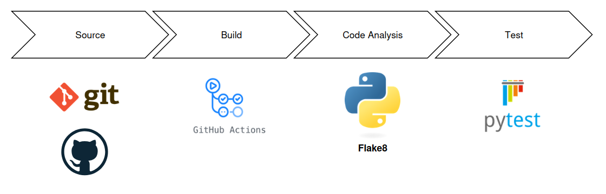
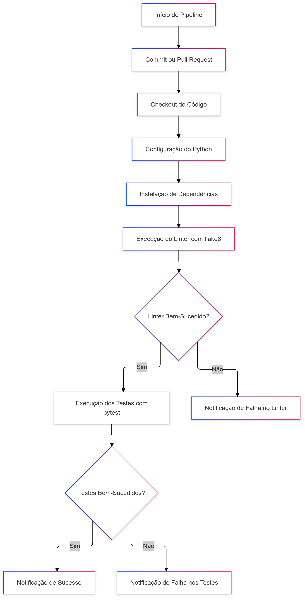

# Relatório de Implementação de Integração Contínua (CI)

## ECD11 Entrega Contínua e DevOps
> Grupo 2:
> Daniel Nigri, Lorenzo Moreira Donatti, Mateus Orlandin Lorenzatti, Matheus dos Santos Garcia, Nícolas Cendron Fernandes, Raul Germano da Silva.


## Objetivo

O objetivo deste trabalho é criar um pipeline de Integração Contínua (CI) para um repositório de código em Python, implementando os passos essenciais da prática de CI e documentando o processo. A entrega final consiste em um repositório contendo o código-fonte, o pipeline configurado e uma documentação detalhada do processo de CI, incluindo um diagrama ilustrando as etapas.

## Descrição da Atividade

Em grupo, escolhemos criar um novo repositório para implementar um processo completo de Integração Contínua. O projeto consiste em um pipeline de dados simples que lê um arquivo CSV, normaliza os dados e treina um modelo de regressão linear. Abaixo estão os passos realizados para configurar o pipeline de CI.

### 1. Criação do Repositório de Código

Utilizamos a plataforma GitHub para criar um novo repositório. A organização do código foi feita seguindo boas práticas, com a seguinte estrutura:

```
.
├── preprocess/
│   ├── __init__.py
│   └── preprocess_data.py
├── ml_model/
│   ├── __init__.py
│   └── model.py
├── tests/
│   ├── __init__.py
│   ├── test_preprocess_data.py
│   └── test_model.py
├── main.py
└── requirements.txt
```

**Boas Práticas Adotadas:**

- **Versionamento:** Utilização do Git para controle de versão.
- **Convenções de Commits:** Uso de mensagens de commit claras e descritivas.
- **Estruturação de Branches:** Adoção de uma estratégia de branches, utilizando `main` para produção e `develop` para desenvolvimento.

### 2. Configuração do Processo de Build Automatizado

Implementamos um build automatizado utilizando GitHub Actions. O arquivo de configuração `.github/workflows/ci.yml` foi criado para definir o pipeline de CI, que inclui as seguintes etapas:

- Instalação das dependências do projeto.
- Execução dos testes automatizados com `pytest`.

```yaml
name: CI Pipeline

on:
  push:
    branches:
      - main
      - develop
  pull_request:
    branches:
      - main
      - develop

jobs:
  build:
    runs-on: ubuntu-latest

    steps:
      - name: Checkout code
        uses: actions/checkout@v2

      - name: Set up Python
        uses: actions/setup-python@v2
        with:
          python-version: '3.10'

      - name: Install dependencies
        run: |
          python -m pip install --upgrade pip
          pip install -r requirements.txt

      - name: Run tests
        run: |
          pytest
```

### 3. Configuração de Testes Automatizados

Para garantir a integridade do código, foram implementados testes automatizados utilizando a biblioteca `pytest`. Os testes incluem:

- Testes de funções de pré-processamento (normalização e preenchimento de valores ausentes).
- Testes para garantir que o modelo de regressão linear é treinado corretamente.

Os testes são executados automaticamente sempre que há uma mudança no repositório, seja por meio de um commit ou pull request.

### 4. Análise de Qualidade de Código (Opcional)

Embora não obrigatório, implementamos uma etapa de análise de qualidade de código utilizando o `flake8`. Esta ferramenta verifica o estilo de código e possíveis problemas de segurança. A análise é executada como parte do pipeline de CI.

```yaml
      - name: Lint with flake8
        run: |
          pip install flake8
          flake8 .
```

## Diagrama do Processo de CI



*O diagrama acima ilustra as etapas do pipeline de forma simplificada e com as tecnologias presentes em cada etapa.*

-------



*O diagrama acima ilustra as etapas do pipeline de Integração Contínua, desde a codificação até a execução dos testes.*

## Conclusão

O pipeline de Integração Contínua implementado neste projeto garante que o código seja constantemente testado e validado, promovendo a qualidade do software. A automação dos testes e da análise de qualidade proporciona um fluxo de desenvolvimento mais eficiente e confiável.
